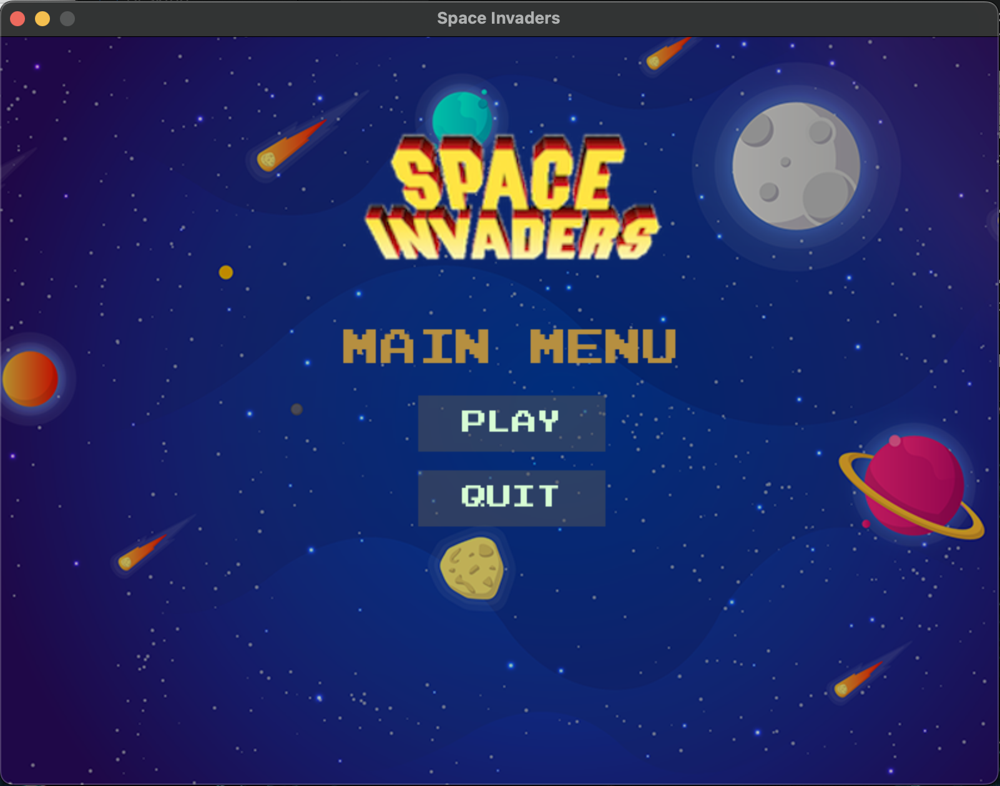
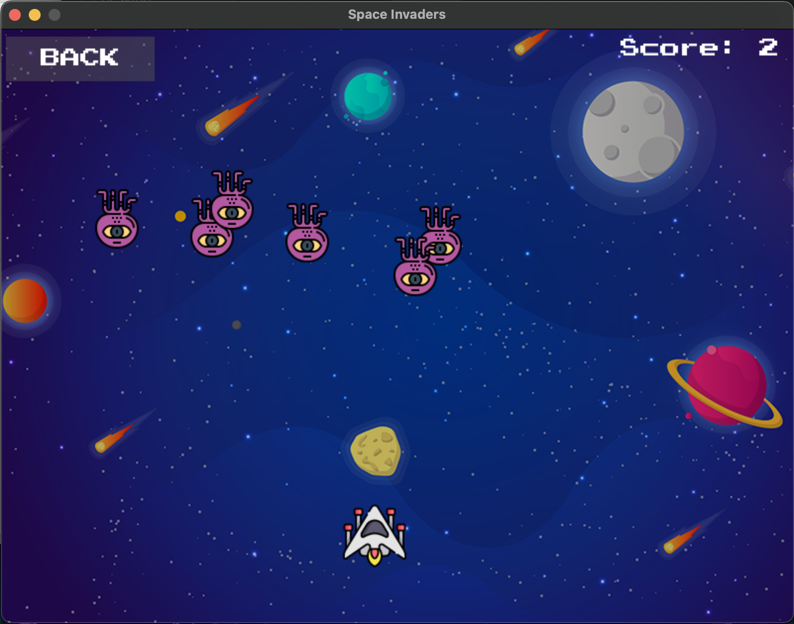
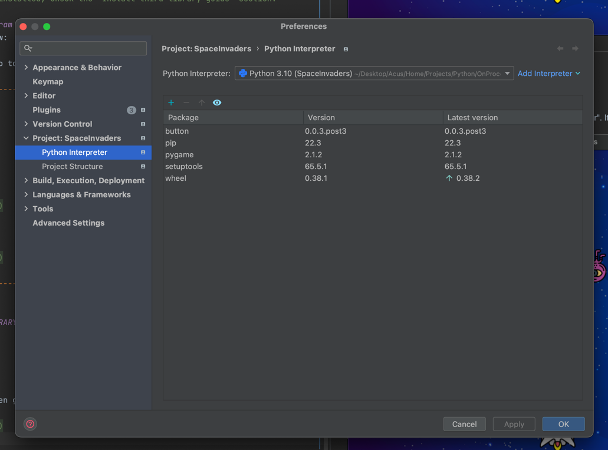
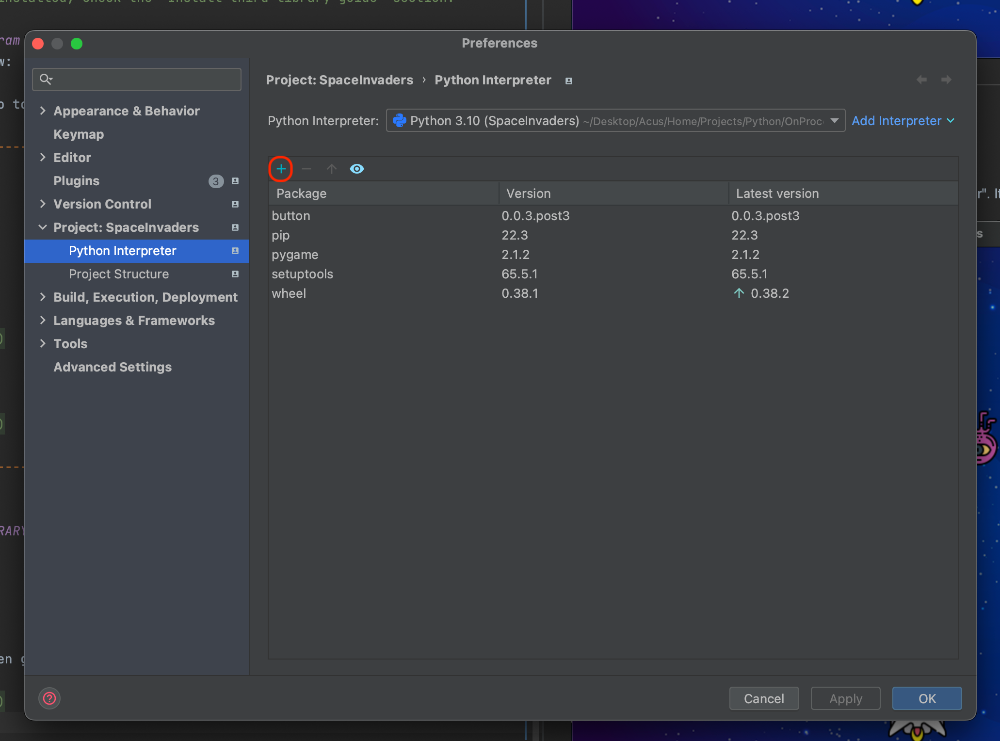

# Space Invaders

- This is a program of a shoot 'em up arcade game.
- Project link (GitHub) : https://github.com/phamgiaphuc/SpaceInvaders
- Project's author: Pham Gia Phuc - Acus
- Personal profile: https://github.com/phamgiaphuc
- Contact Email: acuscodinghcm@gmail.com

### Languages, tools and topics in this project:

1. Python
2. Pygame and Button library

-----------------------------------
<ins>

### USER GUIDE

</ins>

### STEP 1:  Before running program, you make sure your computer already installed tools below:

- Python version 18.0.2 or later.
- The libraries used in this project: [pygame](https://www.pygame.org/wiki/about) (version 2.1.2), [button](https://github.com/azurelysium/button) (version 0.0.3.post3).

> If the library is not installed, check the "Install third library guide" section.

### STEP 2: Run the program
Click the file path below:

- To run **the game**, go to: [main.py](main.py)

-----------------------------------
<ins>

### GAME PICTURES

</ins>

- **Menu stage:**



- **Play stage:**



-----------------------------------
<ins>

### INSTALLING THIRD LIBRARY GUIDE

</ins>

#### Step 1:

- Go to "Preferences" then go to "Project" and "Project Interpreter". It will look like this



### Step 2:

- Click the "Install" button then search for "pygame" and "button" and download the libraries down to the project.
> Remember to choose the right version for the project.



### Other step:

- You can install the libraries through the terminal
- Installation code:

Pygame library:
```bash
$ pip install pygame
```
Button library:
```bash
$ pip install button
```


